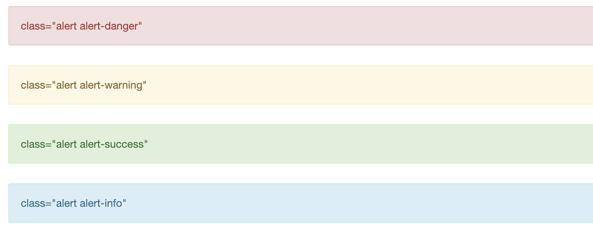

# Jupyter Notebook - HTML

### 1. 글

- **제목** : **<h1>**, **<h2>**, **<h3>**, **<h4>**, **<h5>**, **<h6>**
- 가운데 정렬 : `<h1 align='center'>`
- 글꼴 크기 : `` 
- **일반글**
  - 글꼴 크기 : ``
  - 볼드 : `<strong>`
  - 기울기 :  `<em>`

### 2. 구역

- 구역  생성 : **
**

  - `
` 

  - alert 생성 : **` class="alert alert-info"`**

    - 빨간색 : class="alert alert-danger"
  - 노란색 : class="alert alert-warning"
    - 초록색 : class="alert alert-success"
  - 파란색 : class="alert alert-info"
    

  

  - 여백 크기 : style="margin-top: 20px"

  

### 3. 목차

- 리스트 : **<ol>**

  - 이태릭 순서 : `<ol type="i">`
  - 4번부터 시작 : `<ol start="4">`
    - 순서 항목 : **<li>**, 비순서 항목 : **<ul>**

  - 하이퍼링크 : `<li><a href="#ref1"> 소제목`

- 소제목 하이퍼링크 : ` 소제목`

### 4. 기타

- 공백 : ** **
- 수평선 : **
**

  
